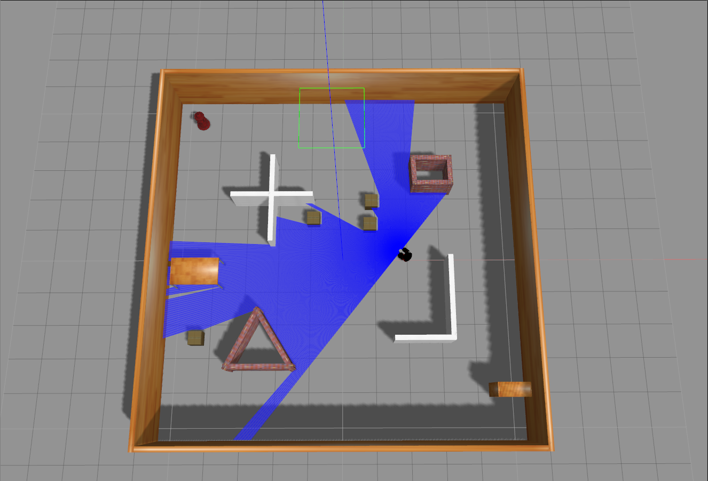
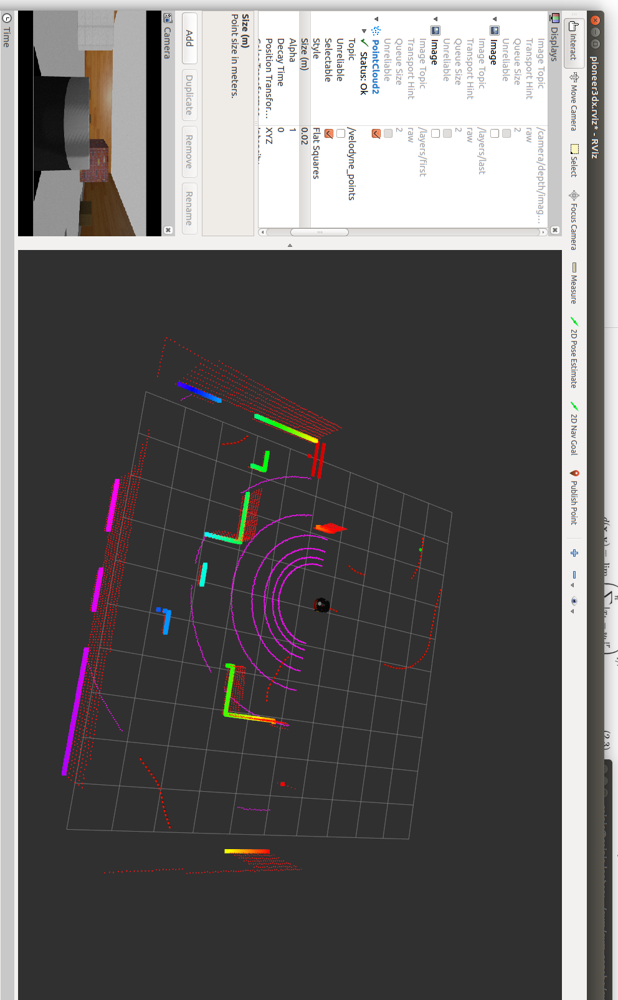

# 🚀 Goal-Driven Autonomous Navigation using Deep Reinforcement Learning

[](https://www.python.org/downloads/)
[](https://pytorch.org/)
[](http://wiki.ros.org/noetic/)
[](LICENSE)

A cutting-edge implementation of autonomous robot navigation using **Twin Delayed Deep Deterministic Policy Gradient (TD3)** algorithm. This project enables mobile robots to learn goal-directed navigation in complex environments while avoiding obstacles using deep reinforcement learning.


*Training demonstration showing the robot learning to navigate to goals while avoiding obstacles*


*Simulation environment with obstacles and navigation targets*


*3D LiDAR sensor data visualization for obstacle detection*

## 🎯 Project Overview

This project implements a sophisticated autonomous navigation system that combines:
- **Deep Reinforcement Learning** with TD3 algorithm
- **3D LiDAR (Velodyne) sensor** for obstacle detection
- **Camera vision** for enhanced environmental understanding
- **ROS Gazebo simulation** for training and testing
- **Goal-driven navigation** with random target generation

The robot learns to navigate to randomly generated goal points while avoiding obstacles, making it suitable for real-world autonomous navigation applications.

## ✨ Key Features

- **🧠 Advanced DRL**: TD3 algorithm for stable and efficient learning
- **📡 Multi-modal Sensing**: Combines 3D LiDAR and camera data
- **🎯 Goal-Oriented**: Learns to reach arbitrary goal positions
- **🚫 Obstacle Avoidance**: Intelligent collision prevention
- **🔄 Continuous Learning**: Real-time adaptation to new environments
- **📊 Performance Monitoring**: TensorBoard integration for training visualization
- **🤖 ROS Integration**: Seamless integration with ROS ecosystem

## 🏗️ Architecture

The system consists of several key components:

### Neural Network Architecture
- **Actor Network**: Processes state and outputs continuous actions
- **Critic Networks**: Dual Q-networks for value estimation
- **Convolutional Layers**: Process camera images (50x50x3)
- **Fully Connected Layers**: Process LiDAR and pose data

### State Representation
- **LiDAR Data**: 24-dimensional laser scan readings
- **Camera Data**: 50x50 RGB images
- **Pose Information**: Robot position and orientation
- **Goal Information**: Target coordinates in polar format

### Action Space
- **Linear Velocity**: Continuous forward/backward movement
- **Angular Velocity**: Continuous turning motion

## 📋 Prerequisites

- **Operating System**: Ubuntu 20.04 LTS
- **ROS**: Noetic (Melodic also supported)
- **Python**: 3.8.10 or higher
- **PyTorch**: 1.10 or higher
- **Gazebo**: 11.0 or higher

## 🚀 Installation

### 1. Clone the Repository
```bash
cd ~
git clone https://github.com/pvrohin/Goal-Driven-Autonomous-Navigation-using-Deep-RL.git
cd Goal-Driven-Autonomous-Navigation-using-Deep-RL
```

### 2. Install Dependencies
```bash
# Install ROS Noetic (if not already installed)
sudo apt update
sudo apt install ros-noetic-desktop-full

# Install PyTorch
pip3 install torch torchvision torchaudio

# Install additional Python packages
pip3 install tensorboard numpy pillow squaternion
```

### 3. Build the Workspace
```bash
cd code/catkin_ws
catkin_make_isolated
```

### 4. Set Up Environment
```bash
# Add to your ~/.bashrc
export ROS_HOSTNAME=localhost
export ROS_MASTER_URI=http://localhost:11311
export ROS_PORT_SIM=11311
export GAZEBO_RESOURCE_PATH=~/Goal-Driven-Autonomous-Navigation-using-Deep-RL/code/catkin_ws/src/multi_robot_scenario/launch

# Source the workspace
source ~/.bashrc
cd ~/Goal-Driven-Autonomous-Navigation-using-Deep-RL/code/catkin_ws
source devel_isolated/setup.bash
```

## 🎮 Usage

### Training the Model

1. **Start Training**:
```bash
cd code/TD3
python3 train_velodyne_td3.py
```

2. **Monitor Training Progress**:
```bash
cd code/TD3
tensorboard --logdir runs
```
Open your browser and navigate to `http://localhost:6006`

3. **Stop Training** (if needed):
```bash
killall -9 rosout roslaunch rosmaster gzserver nodelet robot_state_publisher gzclient python python3
```

### Testing the Trained Model

```bash
cd code/TD3
python3 test_velodyne_td3.py
```

## 📊 Training Process

The training process involves:

1. **Environment Reset**: Robot spawns at random positions
2. **Goal Generation**: Random target points are generated
3. **Action Execution**: Robot moves based on TD3 policy
4. **Reward Calculation**: Based on goal proximity and collision avoidance
5. **Experience Replay**: Storing transitions for learning
6. **Network Updates**: Continuous improvement of policy and value functions

### Training Parameters
- **Episodes**: Configurable training episodes
- **Evaluation**: Periodic performance assessment
- **Learning Rate**: Adaptive learning rates for stable training
- **Batch Size**: Optimized for memory efficiency

## 🎯 Results & Performance

The trained model demonstrates:
- **Efficient Navigation**: Reaches goals with minimal path length
- **Obstacle Avoidance**: Successfully navigates around complex obstacles
- **Generalization**: Adapts to new, unseen environments
- **Real-time Performance**: Fast decision-making for dynamic scenarios

## 📁 Project Structure

```
Goal-Driven-Autonomous-Navigation-using-Deep-RL/
├── code/
│   ├── catkin_ws/           # ROS workspace
│   ├── TD3/                 # TD3 implementation
│   │   ├── train_velodyne_td3.py    # Training script
│   │   ├── test_velodyne_td3.py     # Testing script
│   │   ├── velodyne_env.py          # Environment wrapper
│   │   ├── replay_buffer.py         # Experience replay buffer
│   │   ├── pytorch_models/          # Saved models
│   │   ├── results/                 # Training results
│   │   └── runs/                    # TensorBoard logs
│   ├── velodyne.png                 # LiDAR visualization
│   ├── env1.png                     # Environment screenshot
│   └── training.gif                 # Training demonstration
├── LICENSE                          # MIT License
├── .gitignore                       # Git ignore file
└── README.md                        # This file
```

## 🔧 Customization

### Environment Modifications
- Edit `velodyne_env.py` to modify the training environment
- Adjust obstacle positions and sizes
- Modify reward functions for different objectives

### Network Architecture
- Modify `train_velodyne_td3.py` to change network layers
- Adjust hyperparameters for different scenarios
- Implement additional sensor modalities

### Training Parameters
- Modify learning rates, batch sizes, and episode counts
- Adjust evaluation frequency and criteria
- Customize reward shaping for specific tasks

## 📚 References & Citations

This project is based on research published in ICRA 2022 and IEEE RA-L:

```bibtex
@ARTICLE{9645287,
  author={Cimurs, Reinis and Suh, Il Hong and Lee, Jin Han},
  journal={IEEE Robotics and Automation Letters}, 
  title={Goal-Driven Autonomous Exploration Through Deep Reinforcement Learning}, 
  year={2022},
  volume={7},
  number={2},
  pages={730-737},
  doi={10.1109/LRA.2021.3133591}}
```

## 🤝 Contributing

We welcome contributions! Please feel free to:
- Report bugs and issues
- Suggest new features
- Submit pull requests
- Improve documentation

## 📄 License

This project is licensed under the MIT License - see the [LICENSE](LICENSE) file for details.

## 🙏 Acknowledgments

- **Original Implementation**: Based on the work by Reinis Cimurs et al.
- **ROS Community**: For the excellent robotics framework
- **PyTorch Team**: For the powerful deep learning library
- **Gazebo Team**: For the realistic simulation environment

## 📞 Contact

For questions, issues, or contributions:
- **GitHub Issues**: [Create an issue](https://github.com/pvrohin/Goal-Driven-Autonomous-Navigation-using-Deep-RL/issues)
- **Repository**: [GitHub Repository](https://github.com/pvrohin/Goal-Driven-Autonomous-Navigation-using-Deep-RL)

---

**⭐ Star this repository if you find it helpful!**

*Built with ❤️ for the robotics and AI community*